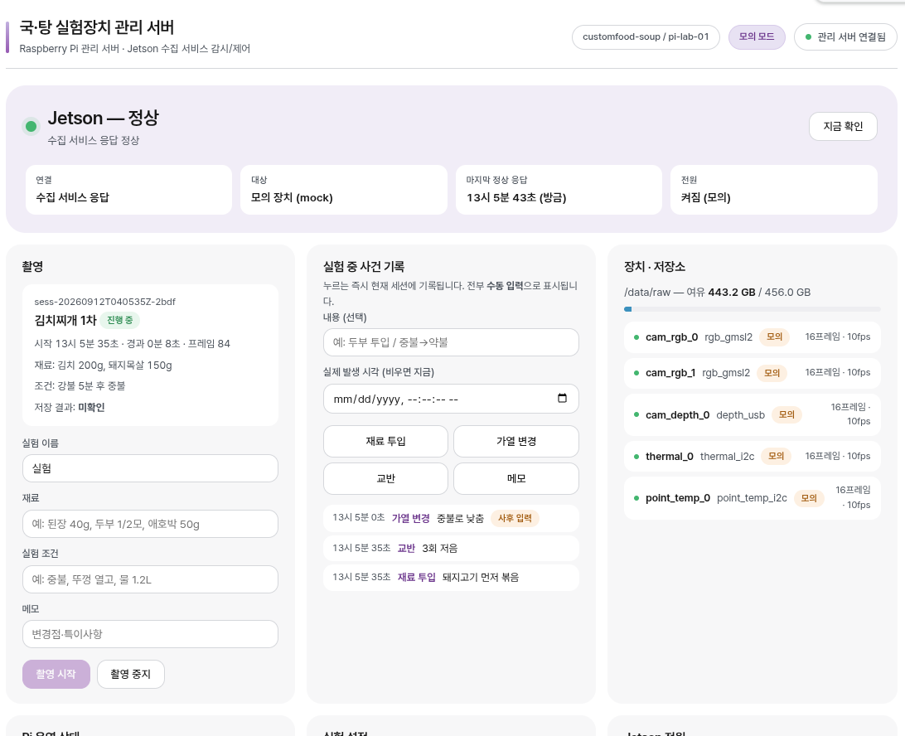
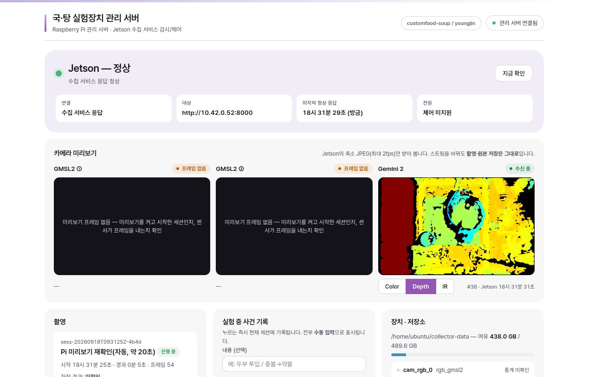

# Pi 관리 서버 (FastAPI)

Raspberry Pi 5에서 **상시 실행**되는 실험장치 관리 서버. Jetson 수집 서비스의 상태를
감시하고, 촬영을 시작/중지하고, 실험 설정과 조작·오류 이력을 남긴다.

> **가장 중요한 성질: Jetson이 꺼져 있어도 이 서버와 관리 화면은 정상 동작한다.**
> (인계 플랜 `docs/handover-plan-2026-09-11.md` §2·§4, 2단계 완료 기준)

| 부분 | 구현 |
|---|---|
| 관리 서버 | Python 3.13 + FastAPI (`app/`) |
| 조작 화면 | 정적 HTML·CSS·JS (`app/static/`) — **빌드 단계 없음** |
| 설정·기록 | SQLite (`data/pi-server.db`) |
| 자동 실행 | systemd (`systemd/soup-pi-server.service`) |

---

## 화면



*2026-09-12 실기기(Raspberry Pi 5) 크로미움 실촬영. 모의 Jetson 구동 상태.*
전체 페이지는 [`docs/img/pi-server-ui-full-20260912.png`](../docs/img/pi-server-ui-full-20260912.png)
— Pi 운영 상태·실험 이력 표·이벤트 목록까지 포함.

---

## 빠른 시작 (모의 모드)

하드웨어 없이 바로 돈다. 모의 Jetson이 프로세스 안에서 함께 뜬다.

```bash
cd ~/customfood-soup-automation/pi-server
python3 -m venv .venv
.venv/bin/pip install -r requirements.txt
SOUP_JETSON_MODE=mock SOUP_POWER_MODE=mock .venv/bin/python -m app.main
# 브라우저: http://localhost:8100   (API 문서: /docs)
```

화면 하단 **"모의 장치 조작"** 카드에서 모의 Jetson을 끄고/켜고 네트워크를 끊어 보면
상태 전이(`정상` → `무응답` → `부팅 중` → `정상`)와 이벤트 기록을 확인할 수 있다.

테스트:

```bash
.venv/bin/pip install -r requirements-dev.txt
.venv/bin/python -m pytest -q
```

---

## 상태 판정 — 무엇을 근거로 말하는가

Pi가 프로브로 **알 수 있는 사실**은 두 가지뿐이다.

1. 수집 서비스 API(`GET /api/v1/status`)가 응답하는가
2. 호스트 TCP 포트(기본 22/SSH)가 열려 있는가 — OS 생존 여부

이 둘의 조합으로만 판정하고, **추정을 사실처럼 표시하지 않는다.**

| 표시 | 조건 | 뜻 |
|---|---|---|
| `online` | API 응답 | 정상 |
| `booting` | 호스트 O · API X · 호스트가 막 올라옴 | 부팅 중(수집 서비스 기동 대기) |
| `service_down` | 호스트 O · API X (부팅 유예 경과) | OS는 살아 있고 수집 서비스만 죽음 → 서비스 재시작 대상 |
| `link_lost` | 호스트 X · API X | 무응답. **전원 OFF인지 네트워크 단절인지 구분 불가** |
| `powered_off` | 위 + **전원 제어기가 OFF 보고** | 전원 꺼짐(근거 있음) |

- 전원 제어 회로가 없으면 `powered_off`는 절대 나오지 않는다 — 근거가 없기 때문이다.
- 마지막 정상 응답이 `SOUP_STALE_AFTER`초보다 오래되면 화면이 **"갱신 중단"**을 표시한다.
  낡은 값을 현재값처럼 보여주지 않는다.
- **통신 단절만으로 서버가 하는 조치는 없다.** 기록하고 표시할 뿐, 전원을 끄거나 세션을
  지우지 않는다(플랜 §4·§5).

## 실험 관리 — 무엇을 어디에 남기는가

| 기록 | 어디에 | 특징 |
|---|---|---|
| **실험(세션)** | `sessions` | 이름·재료·조건·메모 + **설정 스냅샷** + Jetson 저장 결과 요약 |
| **사건** | `events` | 조작·상태변화·오류·**수동 입력**(재료 투입/가열/교반/메모) |
| **Pi 운영 지표** | `host_metrics` | CPU·메모리·온도·디스크 (주기 측정) |

### 공통 식별자

모든 기록에 `schema_version` · `project_id` · `session_id` · `device_id`가 따라붙는다.
다른 연구과제의 기록과 섞이지 않게 하려는 것이라, **세션에는 시작 시점의 값이 박제된다**
— 나중에 `project_id`를 바꿔도 과거 실험의 소속은 변하지 않는다.

```bash
curl -X PUT localhost:8100/api/identity -H 'content-type: application/json' \
     -d '{"project_id":"customfood-soup","device_id":"pi-lab-01"}'
```

### 설정 스냅샷

촬영을 시작하면 그 시점의 `/api/config` 값이 세션에 복사된다. 이후 전역 설정을 바꿔도
**과거 실험의 조건 기록은 변하지 않는다.** 실험 조건을 나중에 추적할 수 있어야 하기 때문.

### 사건의 시각 — 세 가지를 구분한다

| 필드 | 뜻 |
|---|---|
| `ts` | **Pi가 기록한 시각** (항상 있음) |
| `occurred_at` | **실제 발생 시각** — 장치가 알려줬거나 사람이 사후 입력한 경우. 모르면 `null` |
| `detail.sent_at` / `detail.confirmed_at` | 명령을 **보낸 시각**과 Jetson **확인 응답을 받은 시각** |

`occurred_at`이 `null`이면 "모른다"는 뜻이다 — `ts`를 복사해 발생 시각인 척하지 않는다.
경과시간(`latency_ms`)은 벽시계가 아니라 **monotonic 시계**로 잰다(NTP 보정에 흔들리지
않게). 서로 다른 기기의 monotonic 값은 절대 직접 비교하지 않는다.

### 사실을 부풀리지 않는 두 지점

- **시작 요청 성공 ≠ 촬영 시작** — `capture.start_requested`(보냄)와 `capture.started`
  (Jetson이 확인함)가 다른 사건으로 남는다.
- **중지 응답 ≠ 저장 완료** — 중지 확인은 `capture.stopped`, Jetson이 **저장 결과 요약**을
  보내줘야 `capture.save_confirmed`가 남고 세션에 박제된다. 요약이 없으면 화면·내보내기에
  저장 결과가 `미확인`으로 표시된다.

### 조작 출처

인증 기능이 없으므로 **사용자 신원을 지어내지 않는다.** 사건에는 관측 가능한 사실만
남긴다 — `source`는 `ui`(화면) / `api`(스크립트), `detail`에 `client_host`와
`authenticated: false`.

## 촬영 세션

- Pi가 `session_id`(`sess-20260911T143000Z-a1b2`)를 만들어 Jetson에 내려보낸다.
  Jetson의 원본 저장 경로와 Pi의 실험 메타데이터는 이 키로 이어진다.
- **중복 시작 방지** — 활성 세션이 있으면 409.
- **종료 재시도 처리** — 이미 멈춘 세션에 중지를 다시 보내도 200(멱등).
- **Jetson 무응답 중 중지 요청** — 세션을 `stopping`에 두고 503. 연결이 돌아오면
  자동으로 사실관계를 맞춘다(세션을 임의 종료 처리하지 않는다).
- **재접속 시 재동기화** — 정상 응답을 받을 때마다 Pi 기록과 Jetson 보고를 대조한다.
  진행 중 촬영의 사실관계는 **Jetson이 주인**이다(원본을 쓰는 쪽이므로).

| 상황 | 처리 | 이벤트 코드 |
|---|---|---|
| 양쪽 같은 세션 진행 중 | Jetson 상태로 동기화 | — |
| 서로 다른 세션 진행 중 | Pi 쪽을 `unknown`으로 닫고 Jetson 쪽 채택 | `session.mismatch` |
| Pi만 진행 중으로 앎 | 세션을 `unknown`(확인 불가)으로 표시 | `session.orphaned` |
| Jetson만 진행 중 | Pi 기록으로 인계 | `session.adopted` |
| Jetson이 해당 세션 종료 보고 | 종료로 확정 | `capture.stop_confirmed` |

## 전원 제어

기본값은 **미지원**이다. 회로가 없는데 버튼이 동작하는 것처럼 보이면 안 되므로
(플랜 §5), `SOUP_POWER_MODE=unsupported`에서는 조작 요청이 **501**로 거절되고 화면에도
사유가 표시된다. `mock`으로 두면 모의 Jetson에만 작용하며 응답·화면 모두
`simulated: true`로 표시된다.

실제 GPIO 구현은 캐리어 보드 전원 버튼 배선이 확정된 뒤(플랜 6단계)
`app/power.py`의 `create_power_controller()`에 추가한다. 인터페이스는 이미 고정돼 있다.

---

## 로그 — 어디에 쌓이고, 얼마나 남고, 어떻게 꺼내나

기록은 **성격이 다른 세 가지**로 나뉜다. 섞어서 생각하면 필요할 때 못 찾는다.

| 무엇 | 어디에 | 보존 | 꺼내는 법 |
|---|---|---|---|
| **서비스 로그**<br>(프로그램이 어떻게 돌았나) | journald<br>(+ 선택적으로 회전 파일) | journald 기본 정책<br>파일은 `5MB × 4개` | `journalctl -u soup-pi-server -f`<br>`journalctl -u soup-pi-server --since today` |
| **운영 이력**<br>(장비에 무슨 일이 있었나) | SQLite `events` 테이블 | **5000건 또는 90일**<br>(먼저 걸리는 쪽) | 관리 화면 하단 · `GET /api/events`<br>**내보내기: CSV / JSONL** |
| **수집 원본·매니페스트**<br>(무엇을 찍었나) | **Jetson 로컬**<br>`<session>/manifest.jsonl` | 수동 관리(D-006) | Jetson에서 직접. Pi로 오지 않는다 |

### 로그 한 줄 읽는 법

```
2026-09-12 12:40:39+0900 ERROR   app.events: [#5 capture.start_failed] Jetson 무응답 — 시작 실패 (session=sess-20260912T034039Z-8105)
└─ 로컬시각+UTC오프셋      └─등급  └─출처      └─DB 행 번호  └─코드        └─사람이 읽는 설명   └─어느 실험인지
```

- 맨 앞 **`#5`는 SQLite `events` 테이블의 `id`**다. journal에서 본 줄을 DB에서 정확히
  다시 찾을 수 있고, 반대로도 된다. 두 기록면을 잇는 열쇠다.
- **코드(`capture.start_failed`)는 기계가 읽는 값**, 뒤의 한국어는 사람이 읽는 값이다.
  코드는 바뀌지 않으므로 `grep 'capture.start_failed'`로 과거 사례를 모을 수 있다.
- 시각 표기가 **세 군데에서 다르다.** 헷갈리지 않도록 규칙을 고정해 두었다:

  | 어디 | 표기 | 예 |
  |---|---|---|
  | 서비스 로그 | 로컬 시각 + UTC 오프셋 | `2026-09-12 12:40:39+0900` |
  | 이벤트 DB · API | **UTC** ISO8601 | `2026-09-12T03:40:39.123Z` |
  | 관리 화면 | 로컬 시각 | `12시 40분 39초` |

  같은 순간이 로그 `12:40`, DB `03:40Z`로 보이는 건 정상이다(한국은 UTC+9).
  로그에 오프셋을 찍어두었으므로 환산이 필요하면 그 값을 쓰면 된다.

### 이벤트 코드 사전

`grep`으로 찾거나 화면에서 봤을 때 뜻을 알 수 있도록 전부 적어둔다.

| 코드 | 등급 | 뜻 |
|---|---|---|
| `server.started` · `server.stopped` | info | 관리 서버 기동·종료 |
| `link.online` | info | Jetson 수집 서비스 응답 정상 |
| `link.service_down` | warn | 호스트(OS)는 응답, 수집 서비스만 무응답 → 서비스 재시작 대상 |
| `link.unreachable` | error | 호스트·서비스 모두 무응답 (전원 OFF/네트워크 단절 구분 불가) |
| `capture.start_requested` | info | 사용자가 촬영 시작을 눌렀음 (아직 확인 전) |
| `capture.started` | info | Jetson이 촬영 시작을 확인 |
| `capture.start_failed` | error | Jetson 무응답·오류로 시작 실패 |
| `capture.start_rejected` | error | Jetson이 시작을 거절(다른 세션 진행 중 등) |
| `capture.stop_requested` | info | 사용자가 중지를 눌렀음 |
| `capture.stopped` | info | Jetson이 중지·저장 완료를 확인 |
| `capture.stop_deferred` | warn | Jetson 무응답 → 중지 보류. 연결 복구 시 자동 확인 |
| `capture.stop_rejected` | error | Jetson이 중지를 거절(세션 ID 불일치 등) |
| `capture.stop_confirmed` | info/error | 재접속 후 해당 세션의 종료(또는 실패)를 확인 |
| `session.adopted` | warn | Pi가 모르던 세션을 Jetson에서 인계받음 |
| `session.orphaned` | warn | Pi는 진행 중으로 알았으나 Jetson은 아님 → "확인 불가"로 표시 |
| `session.mismatch` | error | 양쪽이 **서로 다른 세션**을 진행 중이라 믿음. Jetson 쪽 채택 |
| `capture.start_called` · `capture.stop_called` | info | API 호출 접수(출처·request_id 기록) |
| `capture.start_rejected_local` | warn | 이미 진행 중이라 Pi가 자체 거절 |
| `capture.device_started` | info | Jetson이 보고한 **장치 기준 시작 시각**(`occurred_at`) |
| `capture.save_confirmed` | info | **저장 결과 요약 수신 — 저장 완료 확정** |
| `capture.save_incomplete` | error | 저장이 온전히 끝나지 않음(`ok=false`) |
| `mark.ingredient` · `mark.heat` · `mark.stir` · `mark.note` | info | **수동 입력 사건**(`origin=manual`) |
| `session.info_updated` | info | 실험 정보 수정(변경 전후 기록) |
| `session.reopened_after_restart` | warn | 서버 재시작 시 미완결 세션이 남아 있었음 |
| `host.disk_low` · `host.disk_ok` | warn/info | Pi 디스크 여유 임계값 넘나듦 |
| `host.temp_high` · `host.temp_ok` | warn/info | Pi 온도 임계값 넘나듦 |
| `identity.updated` | info | 과제·장치 식별자 변경 |
| `backup.downloaded` | info | DB 백업 내려받음 |
| `config.updated` | info | 실험 설정 변경(변경 전후 기록) |
| `power.on` · `power.shutdown` | info | 전원 조작 (모의면 `detail.simulated=true`) |
| `power.force-off` | warn | 강제 전원 차단 |
| `power.*_unsupported` | warn | 전원 회로 미구성 상태에서 조작을 시도해 거절됨 |
| `mock.jetson_power` · `mock.jetson_link` | info/warn | **모의 장치** 조작(실물과 무관) |

> 코드를 추가·변경하면 이 표도 함께 갱신할 것. 이 표가 없으면 반년 뒤 로그를 봐도
> `session.orphaned`가 무슨 뜻인지 알 수 없다.

### 반드시 알아둘 것

- **실험 기록은 자동으로 지워지지 않는다.** 보존 정책(정리)의 대상은 세션과 무관한
  운영 로그와 `host_metrics`뿐이다. `sessions`와 **`session_id`가 붙은 사건**은 건드리지
  않는다 — 연구 기록을 로그 정리로 잃지 않기 위한 규칙이다.
- **운영 이벤트는 보존 기간이 지나면 사라진다.** 실험 구간이 끝나면 관리 화면의
  `내보내기: CSV`로 받아 두는 것이 안전하다. 과제 보고서에 그대로 붙일 수 있게
  시간 오름차순 + Excel용 BOM으로 내보낸다.
  ```bash
  curl -OJ "http://localhost:8100/api/events/export?format=csv"          # 전체
  curl -OJ "http://localhost:8100/api/events/export?format=csv&days=7"   # 최근 7일
  ```
- **로깅 설정은 `create_app()`에서 한다.** `main()`에만 두면 systemd가
  `uvicorn app.main:app`으로 띄울 때 설정이 실행되지 않아 **배포 환경에서만 로그가
  사라진다.** 개발 실행에서는 멀쩡해 보이므로 알아채기 어렵다 — 회귀 방지 테스트가 있다
  (`test_logging_is_configured_by_create_app`).
- 접속 로그(uvicorn)도 같은 포맷·같은 목적지로 합쳐 둔다. 갈라져 있으면 장애 시각을
  맞춰 보기 어렵다.
- journald가 디스크를 얼마나 쓸지 제한하려면(선택):
  ```bash
  sudo sed -i 's/^#\?SystemMaxUse=.*/SystemMaxUse=200M/' /etc/systemd/journald.conf
  sudo systemctl restart systemd-journald
  ```

## 카메라 미리보기 (독립 컴포넌트)



*2026-09-18 실제 Jetson + Gemini 2(Depth 선택, `depth_max_mm=1000`). GMSL2 ①·②는 카메라 미연결이라 "프레임 없음".*

**촬영과 원본 저장은 Jetson 수집기가 한다.** 이 모듈은 Jetson의 저속 JPEG 미리보기를 받아 보여 주고,
스트림 전환·갱신·연결 상태만 관리한다. 스트림(Color/Depth/IR)을 바꿔도 Jetson에는 조회(GET)만 나간다.

```
브라우저 camera-preview.js ──GET /api/preview/{sensor}/{stream}──▶ Pi 서버 ──GET /api/v1/capture/preview/…──▶ Jetson
```

- `static/camera-preview.js` + `camera-preview.css` — 바깥 화면을 모르는 독립 모듈. 다른 화면에 끼울 때:
  ```html
  <link rel="stylesheet" href="/static/camera-preview.css"><script src="/static/camera-preview.js"></script>
  <script>
    fetch('/api/preview/config').then(r => r.json()).then(cfg => {
      const view = CameraPreview.mount(document.getElementById('slot'), CameraPreview.fromServerConfig(cfg));
      // view.setActive(false, '세션 없음') · view.destroy()
    });
  </script>
  ```
  설정을 직접 줘도 된다: `{ apiBase, cameras: [{id, label, sensor_id, streams: [{id, label}]}], intervalMs }`.
- **미리보기는 `preview.enabled=true`로 시작한 세션에서만 나온다.** 촬영 카드의 "카메라 미리보기 켜기"(기본 켜짐)가
  저장된 실험 설정에 `preview: {enabled: true, max_fps: 2}`만 얹어 보낸다. 끄고 시작한 세션은 "프레임 없음"이 정상이다.
  깊이 의사색 범위는 `PUT /api/config`의 `preview.depth_max_mm`(100~65535, 비우면 Jetson 기본 4000)로 저장해 두면
  유지된다 — 작업 거리 0.5 m면 1000~1500.
- **요청이 멈추는 때:** 컴포넌트가 화면 밖(스크롤·`display:none`·DOM 제거), 브라우저 탭 숨김, 진행 중 세션 없음, `destroy()`.
  실패가 이어지면 주기를 최대 8배까지 늘린다.
- 카메라 목록은 `SOUP_PREVIEW_CAMERAS`(JSON)로 바꾼다. 기본은 GMSL2 ①(`cam_rgb_0`)·②(`cam_rgb_1`)·Gemini 2(`cam_depth_0`: color/depth/ir).
  형식이 틀리면 기본 목록으로 뜨고 `/api/preview/config`의 `config_error`에 이유가 나온다.
- Pi는 미리보기 그림을 저장하지 않고, 조회를 이벤트로 남기지도 않는다.

## 설정 (환경변수)

전체 목록과 기본값은 `systemd/soup-pi-server.env` 참고. 자주 쓰는 것:

| 변수 | 기본 | 설명 |
|---|---|---|
| `SOUP_JETSON_MODE` | `mock` | `mock` / `http` — **Jetson 연동 교체 지점** |
| `SOUP_JETSON_URL` | `http://192.168.0.51:8000` | 실제 Jetson 수집 서비스 주소 |
| `SOUP_JETSON_PROBE_PORT` | `22` | 호스트 생존 확인용 TCP 포트 |
| `SOUP_POWER_MODE` | `unsupported` | `unsupported` / `mock` |
| `SOUP_PROBE_INTERVAL` | `2` | 감시 주기(초) |
| `SOUP_STALE_AFTER` | `8` | 이 시간 넘으면 "갱신 중단" 표시(초) |
| `SOUP_LINK_LOST_CONFIRM` | `20` | 무응답 확정까지 대기(초) |
| `SOUP_PREVIEW_CAMERAS` | (기본 3면) | 미리보기 카메라 목록(JSON 배열) — 위 "카메라 미리보기" 참고 |
| `SOUP_PREVIEW_INTERVAL_MS` | `1000` | 미리보기 갱신 주기(ms, 하한 500 — Jetson이 최대 2fps) |
| `SOUP_PORT` | `8100` | 서버 포트 |
| `SOUP_DB_PATH` | `data/pi-server.db` | SQLite 경로 |
| `SOUP_LOG_LEVEL` | `INFO` | 로그 레벨 |
| `SOUP_LOG_FILE` | (없음) | 지정하면 회전 파일로도 기록 |
| `SOUP_LOG_MAX_MB` · `SOUP_LOG_BACKUPS` | `5` · `3` | 파일 회전 크기·개수 |
| `SOUP_EVENT_RETENTION` · `_DAYS` | `5000` · `90` | 운영 이벤트 보존(건수·기간) |
| `SOUP_PROJECT_ID` | `customfood-soup` | 과제 식별자 |
| `SOUP_DEVICE_ID` | 호스트명 | 장치 식별자 |
| `SOUP_METRICS_ENABLED` · `_INTERVAL` | `1` · `10` | Pi 지표 수집 여부·주기(초) |
| `SOUP_METRICS_RETENTION` · `_DAYS` | `20000` · `14` | 지표 보존 |

## 상시 실행 (systemd)

```bash
sudo cp systemd/soup-pi-server.service /etc/systemd/system/
sudo cp systemd/soup-pi-server.env /etc/default/soup-pi-server   # 값 수정 후
sudo systemctl daemon-reload
sudo systemctl enable --now soup-pi-server
systemctl status soup-pi-server --no-pager
journalctl -u soup-pi-server -f
```

포트 정리: 관리 서버 **8100**, 조리 대시보드 3000, Mosquitto 1883/9001
(`docs/PI5_SETUP.md`).

## API

`/docs`(Swagger)에 전부 있다. 요약:

| 메서드 | 경로 | 설명 |
|---|---|---|
| GET | `/api/health` | 관리 서버 생존(Jetson과 무관하게 항상 200) |
| GET | `/api/status` | 종합 상태(화면이 1.5초마다 읽는 것) |
| POST | `/api/status/refresh` | 즉시 프로브 후 상태 반환 |
| POST | `/api/capture/start` · `/stop` | 촬영 시작·중지 |
| GET | `/api/sessions` · `/api/sessions/{id}` | 세션 이력 |
| GET | `/api/sessions/{id}/export?format=json\|csv\|jsonl` | **실험 1건 번들 내보내기** |
| PATCH | `/api/sessions/{id}` | 실험 정보 보완(이름·재료·조건·메모) |
| POST | `/api/marks` | **실험 중 사건 수동 기록** |
| GET | `/api/events` | 사건·조작·오류 이력 (`session_id`·`request_id`·`origin` 필터) |
| GET | `/api/metrics`, POST `/api/metrics/sample` | Pi 운영 지표 |
| GET | `/api/identity`, PUT `/api/identity` | 과제·장치 식별자 |
| GET | `/api/backup` | **일관된 DB 스냅샷** 내려받기 |
| GET·PUT | `/api/config` | 실험 설정(`preview{enabled,max_fps}` 포함) |
| GET | `/api/preview/{sensor_id}/{stream_id}` | **진행 중 세션의 미리보기 1장**(Jetson 저속 JPEG 중계). 없으면 404, Jetson 무응답 503 |
| GET | `/api/preview/config` | 미리보기 컴포넌트 설정(카메라 목록·API 주소·주기) |
| GET | `/api/power`, POST `/api/power/{on,shutdown,force-off}` | 전원(미지원 시 501) |
| POST | `/api/mock/jetson/{power,link}` | 모의 장치 조작(모의 모드에서만 등록) |

Jetson 쪽이 구현해야 할 API 계약은 **`docs/pi-jetson-api.md`** 에 있다.

## 구조

```
app/
  main.py        조립(FastAPI 앱 생성, lifespan에서 감시 시작)
  config.py      환경변수 설정
  models.py      스키마 (Pi 계약의 단일 출처)
  db.py          SQLite (세션·이벤트·설정)
  monitor.py     상태 감시 루프와 판정 규칙
  capture.py     촬영 세션 제어·재동기화
  power.py       전원 제어 어댑터 (기본 미지원)
  routes.py      HTTP API
  identity.py    공통 식별자(project/device/schema/boot)
  hostmetrics.py Pi 자체 운영 지표 수집(외부 의존성 없음)
  logging_setup.py 로깅 설정(배포 경로에서도 반드시 적용)
  jetson/        Jetson 연동 어댑터 (mock / http)
  static/        관리 화면 (빌드 없음)
tests/           API 테스트 30개
```
